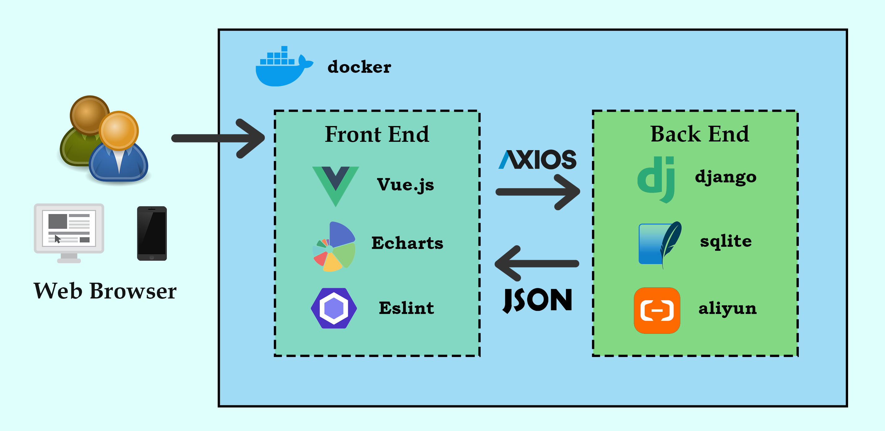

# SJTUer
English | [简体中文](README_CN.md)

     

SJTUers (a portal system for Shanghai Jiao Tong University students) is an unofficial website application. The purpose of this website is to develop a personalized homepage for SJTU students, integrating the commonly used information of SJTU and daily life.

## Background
The current domestic homepage situation is worrying:
- Common default homepage advertisements are rampant and impractical, such as [hao123](https://www.hao123.com/?from=hao123), [2345](https://www.2345.com/), [360](http://se.360.cn/wz.html), etc.;
- Homepages like default search engines can implement too few functions (only for retrieval), and the UI is not personalized enough;
- When SJTUers visit the common SJTU websites, they often need to memorize the URLs or add them to favorites, and they often need to search for different SJTU related information on different websites, which greatly wastes the time of countless SJTUers.

Compared with existing similar homepages:
- Some people have developed a simple and practical homepage, but the lack of personalization has not been resolved, such as [simple navigater](https://www.jianavi.com/);
- ZJU has built a personalized homepage for the students of the school - [ZJUers](https://zjuers.com/), which has the characteristics of simple domain name, simple interface and complete functions, but its individuality Personalization is only for school personalization, we hope to build a personalized homepage for user units.

## Features

- [x] Index of commonly used websites of SJTU, such as Academic Affairs Office, Teaching Information Service Network, canvas, mailbox, etc.
- [x] User module, which supports Jaccount login, and can synchronize the URL and other data personalized by the user.
- [x] Todolist component, which records the user's task list and supports setting task categories and priorities.
- [x] Information components, including announcements from the Academic Affairs Office, SJTU News, Weibo, Zhihu, and bilibili hot search real-time information, using asynchronous programming to implement crawlers.
- [x] Weather components, including real-time weather and 3-day weather forecast, can customize the current city.
- [x] People flow components, including real-time data information visualization of canteens and libraries.
- [x] Search engine, which allows switching among commonly used search engines such as Baidu, Bing, and Google.
- [x] Daily poems, a poem is updated at the bottom of the page with each refresh.
- [x] Clock component, real-time page flip for dynamic display.
- [x] Simple mode, click the clock component to automatically switch the simple mode switch, and display the todolist with the highest priority in simple mode.
- [x] Wallpapers, where users can choose from the wallpaper library or upload their own wallpapers, and synchronize with users.
- [x] AI text to picture, which allows entering a text to describe the content of the wallpaper you want to display when setting the wallpaper, and automatically generate the wallpaper according to the text.

## Usage

This project uses [vue](https://cn.vuejs.org/), [Echarts](https://echarts.apache.org/en/index.html) & [Eslint](https://eslint.org/) to build the front end and [django](https://www.djangoproject.com/), [sqlite](https://www.sqlite.org/index.html) & [aliyun](https://www.alibabacloud.com/en) to build the back end. The front end uses [axios](https://axios-http.com/) to request data from the back end. The workflow is shown as follow.



It could be used like this:

Enter the `/django` directory:
```
pip install -r requirement.txt
python3 manage.py migrate
python3 manage.py runserver
```

Enter the `/vue` directory:
```
npm clean cache -f
npm install
npm run build
```

Follow the terminal prompts to access `localhost:5173/` .

The output png images can be seen in the `/result` directory.

## Contributing

Feel free to dive in! [Open an issue](https://github.com/young1881/SJTUer/issues/new) or submit PRs.

Standard Readme follows the [Contributor Covenant](http://contributor-covenant.org/version/1/3/0/) Code of Conduct.

### Contributors
This project exists thanks to all the people who contribute: 
[herfst77](https://github.com/herfst77), [joyiee](https://github.com/joyiee), [zhanzh0331](https://github.com/zhanzh0331), [Suvanka](https://github.com/Suvanka), [Zhangky11](https://github.com/Zhangky11), [young1881](https://github.com/young1881)

## License
[MIT](LICENSE) &copy; Wortox Young